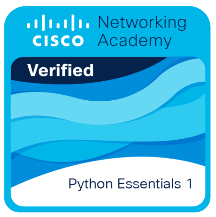
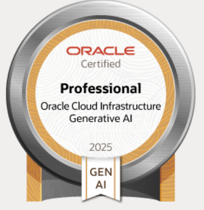

Hi  I'm Akhilesh Y Ragate
==========================================================================================================================================

AI Engineer
----------------------------

## AI Engineer @ Kreesalis | Agentic AI • AI Security • ML Systems

I’m an **AI Engineer at Kreesalis**, focused on building intelligent, secure, and production-ready AI systems.

I combine **AI engineering, software engineering, data engineering, and data science** to turn emerging technologies into scalable solutions.

### 🤖 Agentic AI & AI Systems

* Multi-agent architectures using **LangGraph**, state graphs, cyclic workflows, and tool-driven agents
* **MCP & A2A** for tool access, agent interoperability, and inter-agent collaboration
* Evaluation harnesses and sandboxed environments for autonomous coding agents
* Experience experimenting with **Claude Code, Codex, and Pi Agent**

### 🔐 AI Security & Behavioral Biometrics

* Behavioral biometric ML systems using **44-dimensional keystroke dynamics**
* Achieved **97% accuracy with <100ms inference latency**
* Real-time behavioral detection and policy enforcement engines
* AI-driven approaches to fraud detection, session trust, and security monitoring

### 🧠 Machine Learning & LLMs

* Reasoning and open-source LLM architectures
* **Transformers, MoE, RoPE, ViT**
* Deep learning and computer vision models including **SAM**
* Model evaluation, experimentation, and performance optimization

### ⚡ AI Infrastructure & Acceleration

* **Python** for AI/ML and backend systems
* **CUDA & TensorRT** for GPU acceleration
* Scalable cloud and serverless architectures
* Data pipelines and infrastructure for production AI workloads

I’m particularly interested in the intersection of **AI agents, cybersecurity, behavioral intelligence, and high-performance ML systems**—and in building technology that moves from research ideas to reliable production systems.

* 🌍  I'm based in Bengaluru
* 🖥️  See my portfolio at [quantamaster.github.io/Akhilesh-Y-Ragate.github.io/](http://quantamaster.github.io/Akhilesh-Y-Ragate.github.io/)
* ✉️  You can contact me at [akhileshyragate@gmail.com](mailto:akhileshyragate@gmail.com)
* 🧠  I'm currently learning Gen AI,MLOPS,Rust,OpenAI APIs,.NET,Agentic AI(Openclaw)
* 👥  I'm looking to collaborate on Interesting projects and I'm always open to new opportunities and collaborations in the tech domain.

### Skills

### Socials

 <a href="https://www.github.com/Quantamaster" target="_blank" rel="noreferrer"> <picture> <source media="(prefers-color-scheme: dark)" srcset="https://raw.githubusercontent.com/danielcranney/readme-generator/main/public/icons/socials/github-dark.svg" /> <source media="(prefers-color-scheme: light)" srcset="https://raw.githubusercontent.com/danielcranney/readme-generator/main/public/icons/socials/github.svg" />  </picture> </a> <a href="https://www.linkedin.com/in/akhilesh-y-ragate-a80460242/" target="_blank" rel="noreferrer"> <picture> <source media="(prefers-color-scheme: dark)" srcset="https://raw.githubusercontent.com/danielcranney/readme-generator/main/public/icons/socials/linkedin-dark.svg" /> <source media="(prefers-color-scheme: light)" srcset="https://raw.githubusercontent.com/danielcranney/readme-generator/main/public/icons/socials/linkedin.svg" />  </picture> </a>

## 🎓 Certifications & Credentials Badges

  
  

